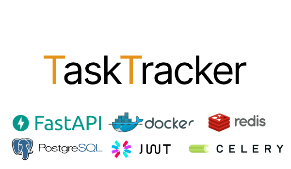

# <p style="text-align: center;">TaskTracker</p>

<p style="text-align:center;"></p>

<p style="text-align: center;">TaskTracker - сервис на FastAPI для создания и сопровождения своих и командных задач.<p>

---


<details><summary style="font-size:20px; font-weight: bold;">Установка и запуск</summary>


* ##### Клонировать репозиторий:
```bash
git clone git@github.com:licaro-1/TaskTracker.git
```


* ##### Перейти в склонированный репозиторий:
```bash
cd ./TaskTracker/
```

* ##### Создать виртуальное окружение и активировать его:
```bash
python -m venv venv
```
```bash
. .\venv\Scripts\activate
```

* ##### Создать .env файл и указать необходимые переменные (по примеру .env-example)


* ##### Создать приватный и публичный ключ:

  * Перейти в Git Bash/cmd, находясь в корне проекта выполнить команды:
    ```bash
    # Generate an RSA private key, of size 2048
    openssl genrsa -out backend/authentication/certs/jwt-private.pem 2048
    ```
    
    ```bash
    # Extract the public key from the key pair, which can be used in a certificate
    openssl rsa -in backend/authentication/certs/jwt-private.pem -outform PEM -pubout -out backend/authentication/certs/jwt-public.pem
    ```


* ##### Установить зависимости:
```bash
pip install -r .\backend\requirements.txt
```


* ##### Запусить докер-контейнеры:
```bash
docker compose up -d
```
* #### Запустить тесты
  * ##### Перейти в директорию backned:
  ```bash
  cd backend/
  ```
  ```bash
  # Перед запуском убедитесь, что в env файле активна брокер-ссылка для pytest
  pytest tests/
  ```
  * После успешных тестов вернуться в корень проекта и закоментировать брокер ссылку для pytest в env файле
  ```bash
  cd ..
  ```
* ##### После успешных тестов пересобрать контейнеры и выгрузить таск-статусы в базу данных:
```bash
docker exec -it tasktracker-app-1 python cli.py load_statuses
```
</details>

####

<details><summary style="font-size:20px; font-weight: bold;">CLI в проекте</summary>

#### Запуск CLI осуществляется через файл cli.py:
`python cli.py command_name`

С помощью CLI можно выгружать в базу данных таск-статусы, пользователей, супер-пользователей.
Выгрузка происходит из раздельных файлов в директории `load_data` (`backend/core/utils/load_data`)

#### Список комманд:

* `load_statuses` - выгрузка статусов из файла

* `load_users` - выгрузка пользователей

* `load_superusers` - выгрузка супер-пользователей


> Для добавления какого-либо объекта в выгрузку нужно добавить данные в соответствующий файл

</details>


## Документация:

---
<div align="center">
    <table >
     <tr>
        <td><b><a href="./assets/api_docs/TaskTrackerAPI-doc.md" download>TaskTracker-API-doc.md</a></b></td>
        <td><b><a href="./assets/api_docs/TaskTrackerAPI-doc.pdf" download>TaskTracker-API-doc.pdf</a></b></td>
     </tr>
    </table>
</div>


### Схемы:

[](assets/endpoint_schema.png) [](assets/db_schema.png)

## Технологии:

---
* Python
  * FastAPI
  * Celery
  * Flower
  * Pytest
  * Alembic
  * loguru
* PostgreSQL
* SQLAlchemy
* Docker
* Docker Compose
* Redis
